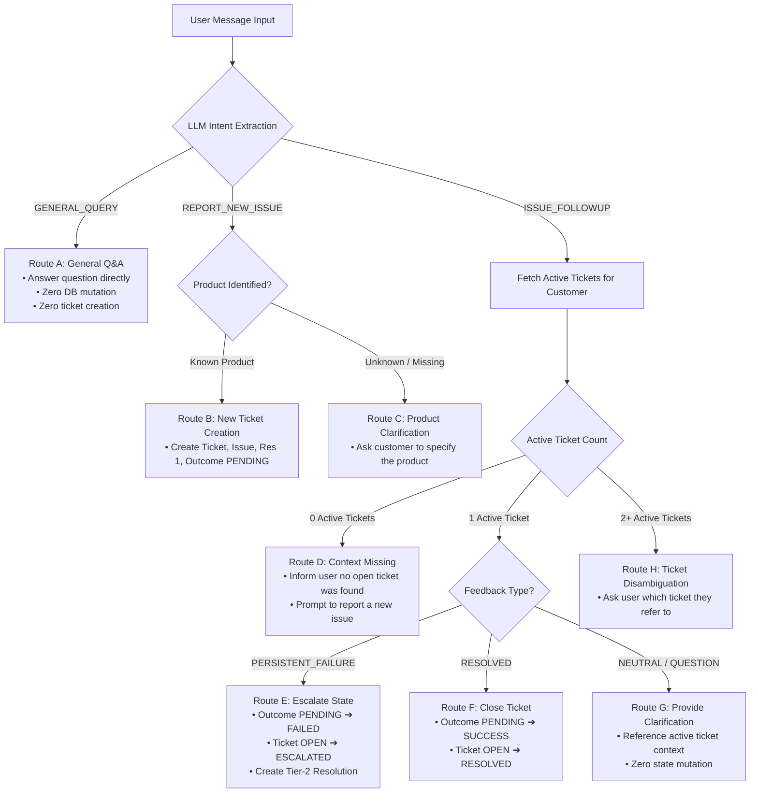

# PHASE 4.6: FINAL AUDITED & LOCKED IMPLEMENTATION SPECIFICATION
## Context-Aware Customer Support Agent (PS-1)

---

# 1. CORRECTIONS APPLIED

1. **Intent-First Message Routing:** Ticket creation is now strictly bound to `REPORT_NEW_ISSUE`. Ticket mutation is strictly bound to `ISSUE_FOLLOWUP` with explicit failure feedback. Zero tickets are created or mutated on `GENERAL_QUERY`.
2. **Context-Contamination Protection:** Explicit follow-ups, new issues for new products, and ambiguous queries follow distinct deterministic paths. Ambiguous messages trigger clarification rather than silent mutation.
3. **Removal of Default Product Fallback:** Removed `DEFAULT_PRODUCT_ID = "PROD-GDS-01"`. Unknown products are treated as unresolved, prompting clarification or explicit new-product capture. No guessing.
4. **Ticket-Scoped ID Strategy (Option A):** All Issue, Resolution, and Outcome IDs are scoped to the parent Ticket ID (e.g., `ISS-TK101-403`, `RES-TK101-SSO`, `OUT-TK101-1`). This guarantees that unique constraints never collide across multiple tickets reporting identical error codes.
5. **Timestamp-Based Recency for Resolutions:** The "latest resolution" is now determined strictly by recorded timestamp (`o.recordedAt DESC`), not by artificial hierarchy tiers. Resolution and its connected Outcome are retrieved as an inseparable atomic pair.
6. **Neutral Technical Language:** Stripped all unbenchmarked claims (*"sub-millisecond"*, *"guaranteed sub-5ms"*, *"zero hallucination"*). Replaced with precise engineering terminology (*"deterministic retrieval"*, *"parameterized Cypher"*, *"grounded response generation"*).
7. **Honest System Boundaries:** Removed all claims of actual external dispatch (no mock claims of emailing Cloud Ops or Jira tickets). Responses explicitly use honest internal status wording: *"I've escalated Ticket #TK-101 in the support workflow for Tier-2 review."*
8. **Smallest Relevant Context Rule:** Graph retrieval is strictly bounded to the active ticket subgraph directly connected to the user's intent. The customer's broader history is never dumped into the prompt.

---

# 2. FINAL ROUTING RULES



### Deterministic Routing Matrix:

| Scenario / User Input | Extracted Intent | Context State | Routing Decision & Action |
|---|---|---|---|
| *"What are your support hours?"* | `GENERAL_QUERY` | Any | Provide direct answer. **No DB reads or writes.** |
| *"My GDS workspace fails with 403 on launch."* | `REPORT_NEW_ISSUE` | Known product (`PROD-GDS-01`) | Create `SupportTicket (OPEN)`, `Issue`, `Resolution 1`, `Outcome (PENDING)`. |
| *"I have a problem with my Python course."* | `REPORT_NEW_ISSUE` | Known product (`PROD-PY-01`) | Create new ticket for Python course. **Does not touch GDS ticket.** |
| *"My workspace is broken."* (No product named) | `REPORT_NEW_ISSUE` | Product unresolved | Ask: *"Which workspace or product are you experiencing issues with?"* |
| *"It's still not working."* | `ISSUE_FOLLOWUP` (Failure) | 1 active ticket found | Mutate `Outcome → FAILED`, `Ticket → ESCALATED`, append Tier-2 resolution. |
| *"The GDS workspace is still showing 403."* | `ISSUE_FOLLOWUP` (Failure) | Active GDS ticket found | Match specific ticket by product link, mutate to `FAILED` & `ESCALATED`. |
| *"I have another problem."* | `ISSUE_FOLLOWUP` (Ambiguous) | 1 active ticket found | Ask: *"Are you experiencing another issue with your GDS workspace, or is this regarding a different product?"* **Zero mutation.** |
| *"It worked, thank you!"* | `ISSUE_FOLLOWUP` (Resolved) | 1 active ticket found | Mutate `Outcome → SUCCESS`, `Ticket → RESOLVED`. |

---

# 3. FINAL PRODUCT RESOLUTION RULES

### Explicit Product Mapping (No Default Fallback):
```python
KNOWN_PRODUCTS = {
    "PROD-GDS-01": {
        "name": "Graph Data Science Workspace",
        "aliases": ["graph data science workspace", "gds workspace", "gds"]
    },
    "PROD-AURA-01": {
        "name": "Neo4j AuraDB Enterprise",
        "aliases": ["neo4j auradb enterprise", "auradb", "aura"]
    },
    "PROD-PY-01": {
        "name": "Python Application Driver",
        "aliases": ["python application driver", "python course", "python driver"]
    }
}

def resolve_product_id(extracted_name: Optional[str]) -> Optional[str]:
    if not extracted_name:
        return None
    cleaned = extracted_name.strip().lower()
    for prod_id, meta in KNOWN_PRODUCTS.items():
        if cleaned == meta["name"].lower() or cleaned in meta["aliases"]:
            return prod_id
    return None  # UNRESOLVED: Never guess or default to GDS
```

- If `resolve_product_id` returns `None` during `REPORT_NEW_ISSUE`, the system does **not** create a ticket. It prompts the user for clarification.

---

# 4. FINAL ID & UNIQUENESS STRATEGY (Ticket-Scoped)

To ensure that unique database constraints never fail when multiple tickets encounter the same error code (`403`) or apply the same action (`CLEAR_SSO_CACHE`), all diagnostic and resolution nodes are strictly **ticket-scoped**:

```text
Node ID Formats:
• SupportTicket:  "TK-" + auto_id            (e.g., "TK-101")
• Issue:          "ISS-" + ticketId + "-" + code (e.g., "ISS-TK101-403")
• Resolution:     "RES-" + ticketId + "-" + seq  (e.g., "RES-TK101-01", "RES-TK101-02")
• Outcome:        "OUT-" + ticketId + "-" + seq  (e.g., "OUT-TK101-01", "OUT-TK101-02")
• Interaction:    "INT-" + uuid4()           (e.g., "INT-d4a1...")
```

### Constraints Applied:
```cypher
CREATE CONSTRAINT customer_email_unique IF NOT EXISTS FOR (c:Customer) REQUIRE c.email IS UNIQUE;
CREATE CONSTRAINT product_id_unique IF NOT EXISTS FOR (p:Product) REQUIRE p.id IS UNIQUE;
CREATE CONSTRAINT ticket_id_unique IF NOT EXISTS FOR (t:SupportTicket) REQUIRE t.id IS UNIQUE;
CREATE CONSTRAINT issue_id_unique IF NOT EXISTS FOR (i:Issue) REQUIRE i.id IS UNIQUE;
CREATE CONSTRAINT resolution_id_unique IF NOT EXISTS FOR (r:Resolution) REQUIRE r.id IS UNIQUE;
CREATE CONSTRAINT outcome_id_unique IF NOT EXISTS FOR (o:Outcome) REQUIRE o.id IS UNIQUE;
CREATE CONSTRAINT interaction_id_unique IF NOT EXISTS FOR (n:Interaction) REQUIRE n.id IS UNIQUE;
```

---

# 5. FINAL RETRIEVAL LOGIC

### Query Definition (Ordered by Timestamp Recency):
The retrieval query enforces atomic pairing between a `Resolution` and its directly connected `Outcome`, ordered strictly by `o.recordedAt DESC`:

```cypher
MATCH (c:Customer {email: $email})-[:OPENED_TICKET]->(t:SupportTicket)
WHERE t.status IN ['OPEN', 'ESCALATED']
MATCH (t)-[:TARGETS]->(p:Product)
MATCH (t)-[:EXHIBITS]->(i:Issue)
OPTIONAL MATCH (t)-[:ATTEMPTED]->(r:Resolution)-[:HAS_OUTCOME]->(o:Outcome)
WITH t, p, i, r, o
ORDER BY o.recordedAt DESC
WITH t, p, i, collect({resolution: r, outcome: o})[0] AS latestPair
RETURN t.id AS ticketId,
       t.status AS ticketStatus,
       p.id AS productId,
       p.name AS productName,
       i.errorCode AS errorCode,
       i.description AS issueDescription,
       latestPair.resolution.id AS resolutionId,
       latestPair.resolution.actionName AS lastActionName,
       latestPair.resolution.instructions AS lastInstructions,
       latestPair.outcome.id AS outcomeId,
       latestPair.outcome.status AS lastOutcomeStatus,
       t.updatedAt AS ticketUpdatedAt
ORDER BY t.updatedAt DESC;
```

---

# 6. FINAL STATE MACHINE

### SupportTicket Lifecycle:
$$\mathbf{OPEN} \xrightarrow[\text{feedback\_type == 'PERSISTENT\_FAILURE'}]{\text{Customer explicit failure signal}} \mathbf{ESCALATED} \xrightarrow[\text{feedback\_type == 'RESOLVED'}]{\text{Customer confirms fix}} \mathbf{RESOLVED}$$

### Outcome Lifecycle:
$$\mathbf{PENDING} \xrightarrow[\text{feedback\_type == 'PERSISTENT\_FAILURE'}]{\text{Customer confirms persistent error}} \mathbf{FAILED}$$
$$\mathbf{PENDING} \xrightarrow[\text{feedback\_type == 'RESOLVED'}]{\text{Customer confirms success}} \mathbf{SUCCESS}$$

---

# 7. FINAL AGENT BOUNDARIES

```text
┌────────────────────────────────────────────────────────────────────────┐
│                        FINAL BOUNDARY DEFINITION                       │
├───────────────────────────────────┬────────────────────────────────────┤
│ LLM RESPONSIBILITIES              │ BACKEND RESPONSIBILITIES           │
├───────────────────────────────────┼────────────────────────────────────┤
│ 1. Structured JSON extraction     │ 1. Intent validation & routing     │
│    (intent, product, code,        │ 2. Canonical Product ID resolution │
│     feedback_type)                │ 3. Database connection & pooling   │
│ 2. Natural phrasing of response   │ 4. Deterministic Cypher execution  │
│    using ONLY supplied context    │ 5. State machine transition guards │
│                                   │ 6. Subgraph extraction for UI      │
├───────────────────────────────────┼────────────────────────────────────┤
│ STRICT PROHIBITIONS               │ HONEST CLAIM STANDARDS             │
├───────────────────────────────────┼────────────────────────────────────┤
│ • No free-form Cypher generation  │ • No claims of contacting Slack/   │
│ • No direct database mutations    │   Jira/Email systems               │
│ • No hallucinated ticket IDs      │ • Acknowledge internal workflow    │
│ • No silent product defaulting    │   status update only               │
└───────────────────────────────────┴────────────────────────────────────┘
```

---

# 8. FINAL CRITICAL DEMO FLOW (3-Minute Sequence)

```text
1. [Seed Demo Persona]
   • Click [1. Seed Customer] ➔ Neo4j seeds Alice Chen + GDS Workspace.
   • Graph Inspector renders Alice connected to Product.

2. [Session 1: Report Issue]
   • Click [2. Send Session 1 Issue] ("My GDS workspace fails with Error 403 on launch").
   • Route: REPORT_NEW_ISSUE.
   • Neo4j creates: Ticket TK-101 (OPEN), Issue (403), Resolution 1 (CLEAR_SSO_CACHE), Outcome (PENDING).
   • Agent prescribes clearing SSO cache.

3. [Simulate Session Break]
   • Click [3. Simulate Break (Wipe UI)] ➔ Chat messages array set to empty [].
   • Visual divider: "--- SESSION BREAK (NO IN-MEMORY CONVERSATION STATE) ---".

4. [Session 2: The Vague Return]
   • Click [4. Send 'It's still not working'] (4 words only).
   • Route: ISSUE_FOLLOWUP with explicit failure.
   • Backend queries Neo4j ➔ identifies TK-101 ➔ mutates Outcome to FAILED ➔ mutates Ticket to ESCALATED ➔ creates Tier-2 Resolution.
   • Agent responds: "Welcome back Alice. I see that clearing your SSO cache didn't resolve Error 403 on your GDS Workspace. I have escalated Ticket #TK-101 in the support workflow for Tier-2 review."
   • Graph Inspector displays red FAILED badge and orange ESCALATED badge in real time.
```

---

# 9. FINAL LOCKED SPECIFICATION

| Attribute | Specification |
|---|---|
| **Backend** | Python 3.11+ / FastAPI / Pydantic v2 / official `neo4j` Python driver |
| **Frontend** | React 18 / Vite / Tailwind CSS / SVG Graph Inspector |
| **Database** | Neo4j AuraDB (Cloud) |
| **LLM Engine** | Gemini Flash via `google-genai` SDK (Strict JSON Schema output) |
| **Product Canonical ID** | `PROD-GDS-01` (Resolved via alias mapping; zero defaulting) |
| **Node ID Strategy** | Ticket-scoped: `TK-101`, `ISS-TK101-403`, `RES-TK101-01`, `OUT-TK101-01` |
| **Recency Determination**| `ORDER BY o.recordedAt DESC` on atomic `{resolution, outcome}` pairs |
| **Routing Guard** | Intent-first: `GENERAL_QUERY` (read-only), `REPORT_NEW_ISSUE` (create), `ISSUE_FOLLOWUP` (mutate only on explicit failure) |

---

# 10. REMAINING IMPLEMENTATION RISKS

1. **LLM Extraction Ambiguity:** User types colloquial slang (*"still busted"*).
   - *Mitigation:* LLM system prompt explicitly instructs classifying `"still busted"`, `"didn't help"`, `"same issue"` as `feedback_type: 'PERSISTENT_FAILURE'`.
2. **Double Click During Demo:** User clicks demo buttons rapidly.
   - *Mitigation:* Frontend sets `isProcessing = true` and disables all buttons until the API response resolves.

---

# READY FOR PHASE 5 IMPLEMENTATION
