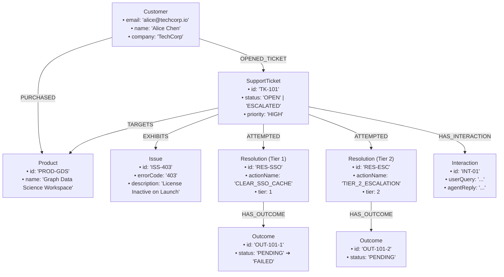
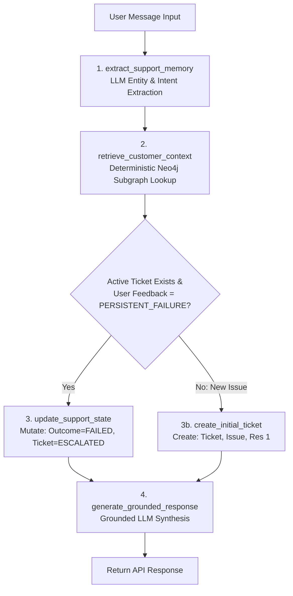

# PHASE 4 — IMPLEMENTATION PLAN & TECHNICAL SPECIFICATION
## Context-Aware Customer Support Agent (PS-1)

---

# 1. FINAL STACK

| Layer | Technology & Version | Purpose | Why Selected | Deliberate Alternative Rejected |
|---|---|---|---|---|
| **Frontend** | **React 18 + Vite + Tailwind CSS** | Single-page split-screen UI (Chat + Live Graph Inspector) | Instant build/hot-reload ($< 50$ms), zero configuration, clean styling via Tailwind utility classes. | **Next.js** — rejected due to SSR overhead, routing complexity, and slower cold boot during a 2-hour sprint. |
| **Backend** | **FastAPI (Python 3.11+)** | REST API, orchestration, Pydantic data validation | High execution speed, automatic Swagger/OpenAPI docs, native async support, seamless integration with official Neo4j Python driver and Pydantic v2. | **Node.js/Express** — rejected because Python enables rapid typed validation with Pydantic without requiring a separate TypeScript compile step for backend scripts. |
| **Graph DB** | **Neo4j AuraDB (Cloud) / Neo4j 5.x** | Primary stateful memory store | Native graph traversals, index-free adjacency for sub-graph extraction, multi-hop relationship queries. | **In-memory SQLite / relational DB** — rejected because modeling and mutating multi-hop $Ticket \rightarrow Issue \rightarrow Resolution \rightarrow Outcome$ state requires rigid foreign-key JOINs and offers no visual graph traversal for judges. |
| **Driver** | **`neo4j` (Official Python Driver 5.x)** | Database connectivity | Binary Bolt protocol over encrypted WebSocket (`neo4j+s://`), connection pooling, parameterized query safety. | **Community ORMs (Neomodel)** — rejected due to ORM abstraction overhead and risk of query generation bugs under time constraints. |
| **LLM Engine** | **Google Gemini Flash (via `google-genai` SDK or OpenAI-compatible endpoint)** | Entity extraction and grounded response synthesis | Low latency, reliable JSON Schema output enforcement, low cost, minimal setup. | **Local Ollama / Self-hosted model** — rejected due to unpredictable latency and hardware dependency on local laptop GPU. |
| **Graph Visualizer** | **HTML5 Canvas / SVG / Vis-Network (React)** | Visualizing the active subgraph in real time | Standalone, lightweight, renders node/relationship states dynamically without requiring external BI tools. | **Neo4j Bloom / Browser iframe** — rejected because an embedded custom UI component guarantees a unified, polished single-screen demo. |

---

# 2. FINAL PROJECT STRUCTURE

```text
neo4j_hackathon/
├── backend/
│   ├── app/
│   │   ├── __init__.py
│   │   ├── main.py              # FastAPI app initialization, CORS, route mounting
│   │   ├── config.py            # Environment variable loading & validation (Pydantic BaseSettings)
│   │   ├── database.py          # Neo4j driver connection pool, lifecycle management, session helpers
│   │   ├── schemas.py           # Pydantic v2 data models (Input, Extraction, Retrieval, API Responses)
│   │   ├── cypher_library.py    # Pre-compiled, parameterized Cypher queries (NO dynamic string formatting)
│   │   ├── agent.py             # Deterministic support agent orchestration (Extract -> Query -> Reason -> Reply)
│   │   └── routes.py            # API endpoint definitions (/api/chat, /api/graph, /api/demo/seed, /api/demo/reset)
│   ├── requirements.txt         # Minimal Python dependencies (fastapi, uvicorn, neo4j, pydantic, google-genai, python-dotenv)
│   └── .env                     # Local secrets (NEO4J_URI, NEO4J_USERNAME, NEO4J_PASSWORD, GEMINI_API_KEY)
│
├── frontend/
│   ├── src/
│   │   ├── components/
│   │   │   ├── Header.jsx       # App bar with connection status & reset button
│   │   │   ├── ChatPanel.jsx    # Conversation message history and message input form
│   │   │   ├── GraphInspector.jsx # Dynamic interactive canvas/SVG rendering active ticket subgraph
│   │   │   ├── MemoryStatus.jsx # Real-time key-value badges (Ticket ID, Status, Active Product, Last Outcome)
│   │   │   └── DemoControls.jsx # 1-Click scripted demo buttons (Seed, Session 1, Break, Session 2, Reset)
│   │   ├── api/
│   │   │   └── client.js        # Axios / fetch wrapper for backend endpoints
│   │   ├── App.jsx              # Main dual-pane layout mounting Chat and Inspector
│   │   ├── index.css            # Tailwind directives
│   │   └── main.jsx             # React DOM root entry
│   ├── package.json             # Frontend dependencies (react, react-dom, tailwindcss, lucide-react)
│   ├── vite.config.js           # Vite dev server configuration with proxy to backend
│   └── tailwind.config.js       # Tailwind theme configuration
│
├── neo4j/
│   ├── schema.cypher            # DDL scripts: Unique constraints and indexes
│   ├── seed.cypher              # DML scripts: Seed customer (Alice Chen) and product (GDS Workspace)
│   └── queries.cypher           # Reference catalog of all parameterized queries used by backend
│
├── .env.example                 # Template for required environment variables
└── README.md                    # Quickstart guide, demo script, and architectural overview
```

### File Responsibilities & Boundaries:
- **`backend/app/cypher_library.py`**: **ONLY** static Cypher query strings with `$param` bindings. No business logic or API calls belong here.
- **`backend/app/agent.py`**: Orchestrates the sequential pipeline: calling LLM for structured extraction $\rightarrow$ calling `cypher_library` via `database.py` $\rightarrow$ evaluating deterministic business rules $\rightarrow$ generating grounded response. **No raw DB driver logic.**
- **`backend/app/schemas.py`**: Strict Pydantic models. **No DB calls or API route handling.**
- **`frontend/src/components/GraphInspector.jsx`**: Pure presentation component taking node and edge arrays as props. **No business logic or API calls directly inside.**

---

# 3. NEO4J DATABASE SPECIFICATION

### Constraints / Indexes
To ensure fast lookups, data integrity, and strict deduplication, the following uniqueness constraints are applied:

```cypher
// 1. Customer email uniqueness (Primary Lookup Key)
CREATE CONSTRAINT customer_email_unique IF NOT EXISTS
FOR (c:Customer) REQUIRE c.email IS UNIQUE;

// 2. Product ID uniqueness
CREATE CONSTRAINT product_id_unique IF NOT EXISTS
FOR (p:Product) REQUIRE p.id IS UNIQUE;

// 3. SupportTicket ID uniqueness
CREATE CONSTRAINT ticket_id_unique IF NOT EXISTS
FOR (t:SupportTicket) REQUIRE t.id IS UNIQUE;

// 4. Issue ID uniqueness
CREATE CONSTRAINT issue_id_unique IF NOT EXISTS
FOR (i:Issue) REQUIRE i.id IS UNIQUE;

// 5. Resolution ID uniqueness
CREATE CONSTRAINT resolution_id_unique IF NOT EXISTS
FOR (r:Resolution) REQUIRE r.id IS UNIQUE;

// 6. Outcome ID uniqueness
CREATE CONSTRAINT outcome_id_unique IF NOT EXISTS
FOR (o:Outcome) REQUIRE o.id IS UNIQUE;

// 7. Interaction ID uniqueness
CREATE CONSTRAINT interaction_id_unique IF NOT EXISTS
FOR (n:Interaction) REQUIRE n.id IS UNIQUE;
```

---

# 4. FINAL GRAPH MODEL



### Verification of Necessity:
- `Customer`: Mandatory entity anchor for identity.
- `Product`: Mandatory to disambiguate which software instance has the failure.
- `SupportTicket`: Mandatory to preserve lifecycle continuity across sessions.
- `Issue`: Mandatory to store the technical symptom (`403`) independently of the customer.
- `Resolution`: Mandatory to store what action was prescribed.
- `Outcome`: Mandatory to track whether a resolution succeeded or failed based on customer feedback.
- `Interaction`: Mandatory to record the episodic audit trail without bloating the operational subgraph.

---

# 5. EXACT CYPHER OPERATIONS

All queries are executed with explicit parameter dictionaries. Free-form string formatting is strictly forbidden.

### Operation 1: Setup & Constraints (`setup_constraints`)
- **Query:** Constraint creation block (defined in Section 3).
- **Endpoint:** Triggered on application boot (`main.py` lifespan) or `POST /api/demo/reset`.

### Operation 2: Seed Customer & Entitlement (`seed_demo_customer`)
- **Inputs:** `$email`, `$name`, `$company`, `$productId`, `$productName`
- **Purpose:** Pre-seeds the customer and product entitlement prior to incident reporting.
- **Endpoint:** `POST /api/demo/seed`
```cypher
MERGE (c:Customer {email: $email})
ON CREATE SET c.name = $name, c.company = $company
MERGE (p:Product {id: $productId})
ON CREATE SET p.name = $productName
MERGE (c)-[:PURCHASED]->(p)
RETURN c.email AS customerEmail, p.name AS productName;
```

### Operation 3: Session 1 — Create Issue & Initial Support Graph (`create_initial_ticket`)
- **Inputs:** `$email`, `$productName`, `$ticketId`, `$issueId`, `$errorCode`, `$description`, `$resolutionId`, `$actionName`, `$instructions`, `$outcomeId`, `$interactionId`, `$userQuery`, `$agentReply`
- **Purpose:** Creates the initial ticket, links product, issue, prescribed Tier-1 resolution, pending outcome, and interaction record.
- **Endpoint:** `POST /api/chat` (Session 1 flow)
```cypher
MATCH (c:Customer {email: $email})
MERGE (p:Product {name: $productName})
CREATE (t:SupportTicket {
    id: $ticketId,
    status: 'OPEN',
    priority: 'HIGH',
    createdAt: datetime(),
    updatedAt: datetime()
})
CREATE (i:Issue {
    id: $issueId,
    errorCode: $errorCode,
    description: $description
})
CREATE (r:Resolution {
    id: $resolutionId,
    actionName: $actionName,
    instructions: $instructions,
    tier: 1
})
CREATE (o:Outcome {
    id: $outcomeId,
    status: 'PENDING',
    feedback: 'Awaiting customer verification',
    recordedAt: datetime()
})
CREATE (int:Interaction {
    id: $interactionId,
    userQuery: $userQuery,
    agentReply: $agentReply,
    timestamp: datetime()
})
CREATE (c)-[:OPENED_TICKET]->(t)
CREATE (t)-[:TARGETS]->(p)
CREATE (t)-[:EXHIBITS]->(i)
CREATE (t)-[:ATTEMPTED]->(r)
CREATE (r)-[:HAS_OUTCOME]->(o)
CREATE (t)-[:HAS_INTERACTION]->(int)
RETURN t.id AS ticketId, t.status AS ticketStatus, r.actionName AS prescribedAction;
```

### Operation 4: Session 2 — Retrieve Active Ticket Subgraph (`get_active_ticket_context`)
- **Inputs:** `$email`
- **Purpose:** Fetches the active ticket, product, issue, and latest resolution/outcome to detect if an unresolved issue exists.
- **Endpoint:** `POST /api/chat` (Session 2 flow) & `GET /api/graph/{email}`
```cypher
MATCH (c:Customer {email: $email})-[:OPENED_TICKET]->(t:SupportTicket)
WHERE t.status IN ['OPEN', 'ESCALATED']
MATCH (t)-[:TARGETS]->(p:Product)
MATCH (t)-[:EXHIBITS]->(i:Issue)
OPTIONAL MATCH (t)-[:ATTEMPTED]->(r:Resolution)
OPTIONAL MATCH (r)-[:HAS_OUTCOME]->(o:Outcome)
WITH t, p, i, r, o
ORDER BY r.tier DESC, o.recordedAt DESC
WITH t, p, i, collect(r)[0] AS latestResolution, collect(o)[0] AS latestOutcome
RETURN t.id AS ticketId,
       t.status AS ticketStatus,
       p.name AS productName,
       i.errorCode AS errorCode,
       i.description AS issueDescription,
       latestResolution.id AS resolutionId,
       latestResolution.actionName AS lastActionName,
       latestResolution.instructions AS lastInstructions,
       latestOutcome.id AS outcomeId,
       latestOutcome.status AS lastOutcomeStatus
ORDER BY t.updatedAt DESC
LIMIT 1;
```

### Operation 5: Session 2 — Mutate Memory on Feedback ("It's still not working") (`escalate_failed_ticket`)
- **Inputs:** `$ticketId`, `$outcomeId`, `$feedback`, `$newResolutionId`, `$newOutcomeId`, `$interactionId`, `$userQuery`, `$agentReply`
- **Purpose:** Transitions previous outcome to `FAILED`, escalates ticket status to `ESCALATED`, creates Tier-2 resolution and new pending outcome, and logs the interaction.
- **Endpoint:** `POST /api/chat` (Session 2 follow-up)
```cypher
MATCH (t:SupportTicket {id: $ticketId})
MATCH (o:Outcome {id: $outcomeId})
SET o.status = 'FAILED',
    o.feedback = $feedback,
    o.recordedAt = datetime(),
    t.status = 'ESCALATED',
    t.updatedAt = datetime()
CREATE (r2:Resolution {
    id: $newResolutionId,
    actionName: 'TIER_2_ESCALATION',
    instructions: 'Automated diagnostic snapshot forwarded to Cloud Operations. License reprovisioning queued.',
    tier: 2
})
CREATE (o2:Outcome {
    id: $newOutcomeId,
    status: 'PENDING',
    feedback: 'Ticket queued for engineering review',
    recordedAt: datetime()
})
CREATE (int:Interaction {
    id: $interactionId,
    userQuery: $userQuery,
    agentReply: $agentReply,
    timestamp: datetime()
})
CREATE (t)-[:ATTEMPTED]->(r2)
CREATE (r2)-[:HAS_OUTCOME]->(o2)
CREATE (t)-[:HAS_INTERACTION]->(int)
RETURN t.status AS updatedTicketStatus, r2.actionName AS nextActionName;
```

### Operation 6: Visual Graph Subgraph Inspection (`get_customer_subgraph`)
- **Inputs:** `$email`
- **Purpose:** Returns nodes and relationships in a format directly consumable by the UI Graph Inspector.
- **Endpoint:** `GET /api/graph/{email}`
```cypher
MATCH (c:Customer {email: $email})
OPTIONAL MATCH (c)-[r1:PURCHASED]->(p:Product)
OPTIONAL MATCH (c)-[r2:OPENED_TICKET]->(t:SupportTicket)
OPTIONAL MATCH (t)-[r3:TARGETS]->(p)
OPTIONAL MATCH (t)-[r4:EXHIBITS]->(i:Issue)
OPTIONAL MATCH (t)-[r5:ATTEMPTED]->(res:Resolution)
OPTIONAL MATCH (res)-[r6:HAS_OUTCOME]->(out:Outcome)
RETURN c, t, p, i, res, out, r1, r2, r3, r4, r5, r6;
```

### Operation 7: Demo Reset (`reset_demo_state`)
- **Inputs:** `$email`
- **Purpose:** Clears all tickets, issues, resolutions, outcomes, and interactions for the demo customer, restoring the initial state.
- **Endpoint:** `POST /api/demo/reset`
```cypher
MATCH (c:Customer {email: $email})
OPTIONAL MATCH (c)-[:OPENED_TICKET]->(t:SupportTicket)
OPTIONAL MATCH (t)-[:EXHIBITS]->(i:Issue)
OPTIONAL MATCH (t)-[:ATTEMPTED]->(r:Resolution)
OPTIONAL MATCH (r)-[:HAS_OUTCOME]->(o:Outcome)
OPTIONAL MATCH (t)-[:HAS_INTERACTION]->(int:Interaction)
DETACH DELETE t, i, r, o, int;
```

---

# 6. MEMORY DEFINITION

### Structured Memory vs. Episodic Record

```text
┌────────────────────────────────────────────────────────────────────────┐
│                          AGENT MEMORY SCHEMA                           │
├───────────────────────────────────┬────────────────────────────────────┤
│ STRUCTURED MEMORY (State Graph)   │ EPISODIC RECORD (Interaction Log)  │
│ • Mutates and drives agent logic  │ • Append-only historical event log │
├───────────────────────────────────┼────────────────────────────────────┤
│ :Customer (Identity & Account)    │ :Interaction {                     │
│ :Product (Entitlement anchor)     │    id: "INT-101",                  │
│ :SupportTicket (Lifecycle state)  │    userQuery: "...",               │
│ :Issue (Diagnosed technical bug)  │    agentReply: "...",              │
│ :Resolution (Prescribed action)   │    timestamp: datetime()           │
│ :Outcome (Verification state)     │ }                                  │
└───────────────────────────────────┴────────────────────────────────────┘
```

* **Why this is NOT just storing a chat transcript:**
  - A chat transcript is an unstructured block of text. When an LLM reads a raw 20-message transcript, it must expend tokens and infer what the current state is, often getting confused about whether a step was merely discussed, attempted, or resolved.
  - In our architecture, **the state of the world is explicitly reified in the graph**. If an action failed, the node `:Outcome {status: 'FAILED'}` represents that fact. The agent queries this structured state directly, eliminating the need to parse raw conversational history.

---

# 7. AGENT DESIGN

The agent is designed as a single, deterministic Python orchestrator with **four discrete capabilities**:



### Capability Specifications:
1. **`extract_support_memory(user_message: str)`**
   - *Input:* User message text.
   - *Output:* Pydantic object `MemoryExtraction` (`intent`, `product_name`, `error_code`, `symptom`, `feedback_type`).
   - *DB Call:* No.
   - *LLM Call:* Yes (constrained JSON Schema mode).
   - *Type:* Probabilistic extraction with deterministic Pydantic schema validation.

2. **`retrieve_customer_context(email: str)`**
   - *Input:* Customer email.
   - *Output:* Pydantic object `ActiveTicketContext` or `None`.
   - *DB Call:* Yes (Operation 4).
   - *LLM Call:* No.
   - *Type:* 100% Deterministic Cypher query.

3. **`update_support_state(context: ActiveTicketContext, feedback: str)`**
   - *Input:* Active ticket metadata and customer failure confirmation.
   - *Output:* Updated ticket status (`ESCALATED`) and next action name (`TIER_2_ESCALATION`).
   - *DB Call:* Yes (Operation 5).
   - *LLM Call:* No.
   - *Type:* 100% Deterministic state machine mutation.

4. **`generate_grounded_response(context: GroundingContext)`**
   - *Input:* Exact structured triples (Customer, Product, Issue, Prior Fix, Prior Outcome, Next Action).
   - *Output:* Natural language response string.
   - *DB Call:* No.
   - *LLM Call:* Yes (prompt constrained to state payload).
   - *Type:* Grounded natural language generation.

---

# 8. LLM USAGE & BOUNDARIES

### LLM Responsibilities (Strictly Constrained)
1. **Entity & Intent Extraction:** Translates messy user natural language into a structured JSON schema.
2. **Natural Phrasing:** Translates structured diagnostic outcomes into a polite, empathetic, professional response.

### Backend Responsibilities (Full Authority)
1. **Customer Verification:** Asserts user email from session/token (never relies on LLM to invent an identity).
2. **Database Access:** Executes parameterized Cypher queries. The LLM has **zero direct access** to Neo4j.
3. **State Transitions:** Controls when a ticket moves from `OPEN` to `ESCALATED`.
4. **Business Rule Enforcement:** Dictates the policy that failed resolutions are never repeated.

---

# 9. EXACT DATA SCHEMAS (Pydantic Models)

```python
from pydantic import BaseModel, Field
from typing import Optional, Literal
from datetime import datetime

# --- 1. User Message Input ---
class ChatRequest(BaseModel):
    email: str = Field(..., example="alice@techcorp.io")
    message: str = Field(..., example="It's still not working.")
    session_id: str = Field(..., example="session-2")

# --- 2. LLM Extraction Schema ---
class MemoryExtraction(BaseModel):
    intent: Literal["REPORT_NEW_ISSUE", "ISSUE_FOLLOWUP", "GENERAL_QUERY"]
    product_name: Optional[str] = Field(None, description="Identified product name, e.g., 'Graph Data Science Workspace'")
    error_code: Optional[str] = Field(None, description="Numeric or string error code, e.g., '403'")
    symptom: Optional[str] = Field(None, description="Description of the symptom observed")
    feedback_type: Optional[Literal["PERSISTENT_FAILURE", "RESOLVED", "NEUTRAL"]] = Field(
        None, description="Explicit feedback regarding whether a previous fix worked"
    )

# --- 3. Retrieval Result Schema ---
class ActiveTicketContext(BaseModel):
    ticket_id: str
    ticket_status: str
    product_name: str
    error_code: str
    issue_description: str
    resolution_id: str
    last_action_name: str
    last_instructions: str
    outcome_id: str
    last_outcome_status: str

# --- 4. Chat Response Schema ---
class ChatResponse(BaseModel):
    reply: str
    ticket_id: Optional[str]
    ticket_status: Optional[str]
    action_taken: str
    memory_updated: bool
    retrieved_context: Optional[ActiveTicketContext]
    executed_cypher_summary: str
```

---

# 10. API CONTRACT

### Endpoint 1: `POST /api/chat`
* **Request:** `ChatRequest` JSON
* **Response:** `ChatResponse` JSON (HTTP 200)
* **Internal Flow:**
  1. Extract structured entities via LLM (`extract_support_memory`).
  2. Query Neo4j for active ticket context for `email` (`retrieve_customer_context`).
  3. **Branch A (Session 2):** If active ticket exists AND `feedback_type == 'PERSISTENT_FAILURE'`:
     - Execute Operation 5: Mutate prior outcome to `FAILED`, escalate ticket to `ESCALATED`, create Tier-2 resolution.
     - Call LLM with grounding context to synthesize the response.
  4. **Branch B (Session 1):** If no active ticket exists:
     - Execute Operation 3: Create ticket `TK-101`, issue `ISS-403`, resolution `CLEAR_SSO_CACHE`, outcome `PENDING`.
     - Call LLM to provide Tier-1 instructions.
  5. Return response, updated status, and executed Cypher summary.

### Endpoint 2: `GET /api/graph/{email}`
* **Request:** Path parameter `email`
* **Response:**
  ```json
  {
    "nodes": [
      {"id": "alice@techcorp.io", "label": "Customer", "properties": {"name": "Alice Chen"}},
      {"id": "TK-101", "label": "SupportTicket", "properties": {"status": "ESCALATED", "priority": "HIGH"}},
      {"id": "PROD-GDS", "label": "Product", "properties": {"name": "Graph Data Science Workspace"}},
      {"id": "ISS-403", "label": "Issue", "properties": {"errorCode": "403"}},
      {"id": "RES-SSO", "label": "Resolution", "properties": {"actionName": "CLEAR_SSO_CACHE"}},
      {"id": "OUT-101-1", "label": "Outcome", "properties": {"status": "FAILED"}}
    ],
    "relationships": [
      {"source": "alice@techcorp.io", "target": "TK-101", "type": "OPENED_TICKET"},
      {"source": "TK-101", "target": "PROD-GDS", "type": "TARGETS"},
      {"source": "TK-101", "target": "ISS-403", "type": "EXHIBITS"},
      {"source": "TK-101", "target": "RES-SSO", "type": "ATTEMPTED"},
      {"source": "RES-SSO", "target": "OUT-101-1", "type": "HAS_OUTCOME"}
    ]
  }
  ```

### Endpoint 3: `POST /api/demo/seed`
* **Request:** `{ "email": "alice@techcorp.io" }`
* **Response:** `{ "status": "SEEDED", "customer": "Alice Chen", "product": "Graph Data Science Workspace" }`

### Endpoint 4: `POST /api/demo/reset`
* **Request:** `{ "email": "alice@techcorp.io" }`
* **Response:** `{ "status": "RESET_COMPLETE", "message": "All tickets and outcomes cleared." }`

---

# 11. SESSION HANDLING & VERIFYING PERSISTENCE

To objectively prove that memory is persisted in **Neo4j** and not kept in frontend memory or in-memory server state:

1. **Session 1 Execution:**
   - Client sends payload with `session_id: "session-1"`.
   - Ticket and graph elements are committed to Neo4j.
2. **Session Break Simulation:**
   - In the UI, the user clicks **"Simulate Session Break"** (or refreshes the browser page).
   - This action **completely wipes the React state** (`messages = []`).
   - The backend holds **zero in-memory session cache** (stateless FastAPI worker).
3. **Session 2 Execution:**
   - Client sends payload with `session_id: "session-2"` and message: `"It's still not working."`.
   - The backend identifies `alice@techcorp.io`, queries Neo4j via Cypher Operation 4, retrieves the active ticket, and constructs the response exclusively from the database record.

---

# 12. STATE MACHINE

```text
SupportTicket State Machine:
┌──────────┐   Customer reports issue    ┌──────────┐
│  (NONE)  │ ──────────────────────────> │   OPEN   │
└──────────┘                             └────┬─────┘
                                              │ Customer sends: "It's still not working"
                                              │ (explicit confirmation of failure)
                                              v
                                         ┌──────────┐
                                         │ESCALATED │
                                         └──────────┘

Outcome State Machine:
┌──────────┐   Prescribe Resolution 1    ┌──────────┐
│  (NONE)  │ ──────────────────────────> │ PENDING  │
└──────────┘                             └────┬─────┘
                                              │ Customer feedback: PERSISTENT_FAILURE
                                              v
                                         ┌──────────┐
                                         │  FAILED  │
                                         └──────────┘
```

* **Transition Trigger Rule:** An outcome transition from `PENDING` to `FAILED` occurs **if and only if** explicit customer feedback indicates failure (e.g., `"still not working"`, `"didn't fix it"`, `"error remains"`).

---

# 13. RETRIEVAL LOGIC

When a message arrives:
1. **Anchor Identification:** The customer email (`alice@techcorp.io`) is retrieved from the session header.
2. **Active Ticket Filter:** The query matches tickets where `status IN ['OPEN', 'ESCALATED']`.
3. **Single Active Ticket:** Returns the matching ticket.
4. **Multiple Active Tickets (Edge Case Handling):** If multiple exist, order by `updatedAt DESC LIMIT 1`. The agent generates a 1-sentence prompt asking the customer to confirm the ticket ID: *"I found two open tickets. Are you following up on your GDS Workspace issue (TK-101)?"*.
5. **No Active Ticket (Edge Case Handling):** The system falls back to the `REPORT_NEW_ISSUE` flow and creates a new ticket.

---

# 14. RESPONSE GENERATION & GROUNDING

The LLM is prompted strictly with the retrieved subgraph variables.

### Grounding Prompt Template:
```text
You are a senior customer support AI for an enterprise cloud platform.
Generate a concise, empathetic, and professional response to the customer based ONLY on the following verified database facts:

CUSTOMER: {customer_name} ({customer_email})
ACTIVE TICKET: {ticket_id} (Status: {ticket_status})
PRODUCT: {product_name}
REPORTED ISSUE: Error {error_code} - {issue_description}
PREVIOUS ATTEMPTED FIX: {last_action_name} ({last_instructions})
PREVIOUS FIX OUTCOME: FAILED (Customer confirmed failure: "{user_message}")
NEXT ACTION TAKEN: {next_action_name} - {next_instructions}

GUIDELINES:
1. Greet the customer by name.
2. Explicitly acknowledge that their previous attempt to {last_action_name} failed.
3. NEVER recommend repeating {last_action_name}.
4. Confirm that Ticket {ticket_id} has been escalated for license reprovisioning.
5. Do not invent any outside details, phone numbers, or external teams. Keep it under 3 sentences.
```

---

# 15. ERROR HANDLING & FALLBACKS

| Failure Scenario | Root Cause | Fallback Behavior |
|---|---|---|
| **LLM extraction failure** | Invalid JSON response from LLM | Backend regex/keyword fallback: if text contains `"not working"` $\rightarrow$ classify as `ISSUE_FOLLOWUP` + `PERSISTENT_FAILURE`. |
| **Neo4j connection drop** | Transient cloud network error | Return HTTP 503 with user-friendly message: *"Support Memory service temporarily unavailable. Please retry."* |
| **Customer not found** | Unseeded email provided | Auto-provision customer node on the fly with default basic entitlement. |
| **Invalid state transition** | Repeated failure signals on already escalated ticket | Maintain `ESCALATED` status; reassure customer that the ticket is in active engineering review. |

---

# 16. FRONTEND IMPLEMENTATION PLAN

### Component Hierarchy:
```text
App (Main Layout: Grid 2-column on desktop)
 ├── Header
 │    ├── Title & Badge ("NexusGraph Support")
 │    ├── Neo4j Connection Indicator (Green pulse)
 │    └── Reset Demo Button
 ├── Left Column: ChatPanel
 │    ├── Active Persona Badge (Alice Chen - TechCorp)
 │    ├── Message History Scrollable Area
 │    │    ├── Message Bubble (User vs Agent)
 │    │    └── Context Tag (showing Ticket # and Action taken)
 │    └── Message Input Form & Submit Button
 └── Right Column: Live Inspector
      ├── DemoControls (1-Click scripted workflow buttons)
      ├── MemoryStatus (Structured state badges: Ticket ID, Status, Product, Prior Fix)
      └── GraphInspector (Interactive SVG showing the active Neo4j subgraph)
```

---

# 17. GRAPH INSPECTOR SPECIFICATION

The Graph Inspector renders a clean SVG representation of the active subgraph returned by `GET /api/graph/{email}`:

```text
Node Visual Encoding:
• (:Customer)      -> Blue circle (#3B82F6), label: "Customer (Alice)"
• (:SupportTicket)  -> Yellow badge if OPEN (#EAB308), Orange badge if ESCALATED (#F97316)
• (:Product)        -> Indigo rectangle (#6366F1), label: "Product (GDS)"
• (:Issue)          -> Purple diamond (#A855F7), label: "Issue (403)"
• (:Resolution)     -> Slate rounded rect (#64748B), label: "Fix (Clear SSO)"
• (:Outcome)        -> Gray if PENDING (#94A3B8), Red if FAILED (#EF4444)
```

The inspector polls or re-fetches the graph after each message to animate state changes on screen.

---

# 18. DEMO CONTROLS (Scripted 1-Click Sequence)

To eliminate live typing mistakes during the 3-minute pitch, five buttons appear at the top of the Inspector:

1. **`[1. Seed Customer]`**: Calls `POST /api/demo/seed` $\rightarrow$ seeds Alice Chen & GDS Workspace.
2. **`[2. Send Session 1 Issue]`**: Populates and sends: *"Hi, my Graph Data Science workspace fails with Error 403 on launch."*
3. **`[3. Simulate Break (Wipe UI)]`**: Clears frontend messages and displays a visual divider: *`--- 2 DAYS LATER (SESSION BREAK) ---`*.
4. **`[4. Send "It's still not working"]`**: Sends the 4-word follow-up. Demonstrates the graph retrieval and state mutation.
5. **`[5. Reset Demo]`**: Calls `POST /api/demo/reset` $\rightarrow$ restores a blank canvas.

---

# 19. VANILLA COMPARISON (Optional Polish)

A simple toggle in the header: **"Show Amnesiac Baseline"**.
- If toggled ON, the UI displays a simulated side card showing how a standard bot responds to *"It's still not working"*:
  > *"I'm sorry to hear that. Could you please provide your account email, the product name, and a description of the issue you are experiencing?"*
- This cleanly highlights the value proposition of Agent Memory without adding complexity to the backend architecture.

---

# 20. ENVIRONMENT VARIABLES

### `backend/.env`
```ini
# Neo4j Aura Connection
NEO4J_URI=neo4j+s://b0f840d8.databases.neo4j.io
NEO4J_USERNAME=neo4j
NEO4J_PASSWORD=<PASSWORD>

# LLM Configuration
GEMINI_API_KEY=<API_KEY>
LLM_MODEL=gemini-2.5-flash

# Server Configuration
PORT=8000
HOST=0.0.0.0
CORS_ORIGINS=http://localhost:5173
```

---

# 21. SEED DATA

Pre-populated upon pressing `[1. Seed Customer]` or calling `POST /api/demo/seed`:
- **Customer:**
  - `email`: `"alice@techcorp.io"`
  - `name`: `"Alice Chen"`
  - `company`: `"TechCorp Global"`
- **Product:**
  - `id`: `"PROD-GDS-01"`
  - `name`: `"Graph Data Science Workspace"`
  - `category`: `"Cloud Graph Compute"`
- **Entitlement:**
  - `(:Customer)-[:PURCHASED {purchasedAt: '2026-09-01'}]->(:Product)`

---

# 22. EXACT BUILD ORDER (2-Hour Sprint Timeline)

```text
[0:00 - 0:15] STAGE 1: Project Setup & Dependencies
              • Initialize FastAPI project with requirements.txt
              • Initialize Vite + React + Tailwind frontend

[0:15 - 0:30] STAGE 2: Neo4j Driver & Cypher Library
              • Implement database.py with connection pool
              • Implement cypher_library.py with all 7 parameterized queries
              • Run constraints setup and verify with seed script

[0:30 - 0:50] STAGE 3: Backend Core & Pydantic Schemas
              • Implement schemas.py
              • Implement agent.py (LLM extraction + prompt grounding)
              • Implement routes.py (/api/chat, /api/graph, /api/demo/seed, /api/demo/reset)

[0:50 - 1:15] STAGE 4: Backend Verification & Memory Lifecycle
              • Execute curl / script tests: Session 1 -> State verification -> Session 2 -> Mutation
              • Verify Outcome transitions from PENDING to FAILED in AuraDB

[1:15 - 1:45] STAGE 5: Frontend Interface & Components
              • Build ChatPanel, DemoControls, MemoryStatus
              • Build GraphInspector (SVG node/edge renderer)
              • Wire API client to FastAPI backend

[1:45 - 2:00] STAGE 6: End-to-End Demo Polish
              • Test the 1-Click demo script from start to finish
              • Ensure visual transitions (PENDING -> FAILED) render clearly
              • Validate 3-minute pitch timing
```

**Critical Path:** Stages 2, 3, 4, 5. (If running behind, Stage 6 polish and the optional Vanilla toggle can be dropped).

---

# 23. DEFINITION OF DONE

The MVP is complete **only** when all of the following pass verification:
1. `POST /api/demo/seed` creates `Alice Chen` and `Graph Data Science Workspace` in Neo4j.
2. Sending Session 1 message creates `SupportTicket (OPEN)`, `Issue (403)`, `Resolution (CLEAR_SSO_CACHE)`, and `Outcome (PENDING)`.
3. Resetting the frontend does not destroy database memory.
4. Sending `"It's still not working"` in Session 2 retrieves the existing ticket without asking the user for their email or issue.
5. In Neo4j, the outcome changes from `PENDING` to `FAILED`, and the ticket status updates to `ESCALATED`.
6. A new Tier-2 resolution node is appended to the ticket.
7. The agent's response explicitly acknowledges the failed SSO cache step and confirms Tier-2 escalation.
8. The Graph Inspector UI visually displays the updated red `FAILED` badge and orange `ESCALATED` badge.
9. All 5 demo buttons work smoothly without manual text input.
10. The entire demonstration can be completed reliably in under 3 minutes.

---

# 24. CRITICAL PATH VS. OPTIONAL WORK

```text
┌────────────────────────────────────────────────────────┐
│               CRITICAL PATH (MUST COMPLETE)            │
├────────────────────────────────────────────────────────┤
│ 1. Parameterized Cypher queries for Seed, S1, S2       │
│ 2. FastAPI backend with Pydantic extraction & routing  │
│ 3. Working Neo4j driver connection to AuraDB           │
│ 4. Grounded LLM response generation                    │
│ 5. Dual-pane React UI with Chat + Graph Inspector SVG  │
│ 6. 1-Click Scripted Demo Buttons                       │
└────────────────────────────────────────────────────────┘
                           │
                           ▼
┌────────────────────────────────────────────────────────┐
│               OPTIONAL WORK (STRETCH / POLISH)         │
├────────────────────────────────────────────────────────┤
│ • "Vanilla vs. Graph Memory" comparison toggle card    │
│ • Custom animated edge pulsing in SVG Inspector        │
│ • Secondary persona (Bob with brand-new ticket)        │
└────────────────────────────────────────────────────────┘
```
