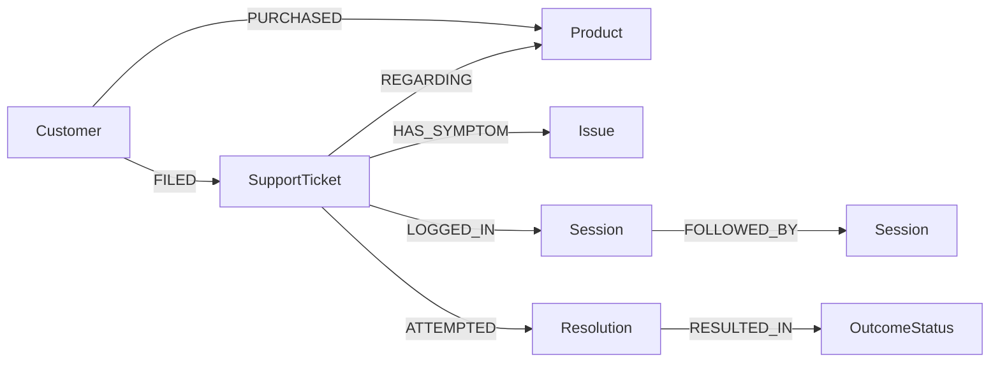
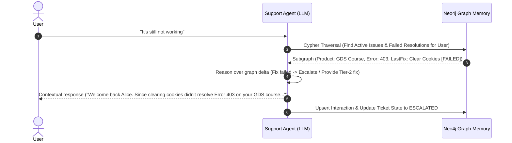
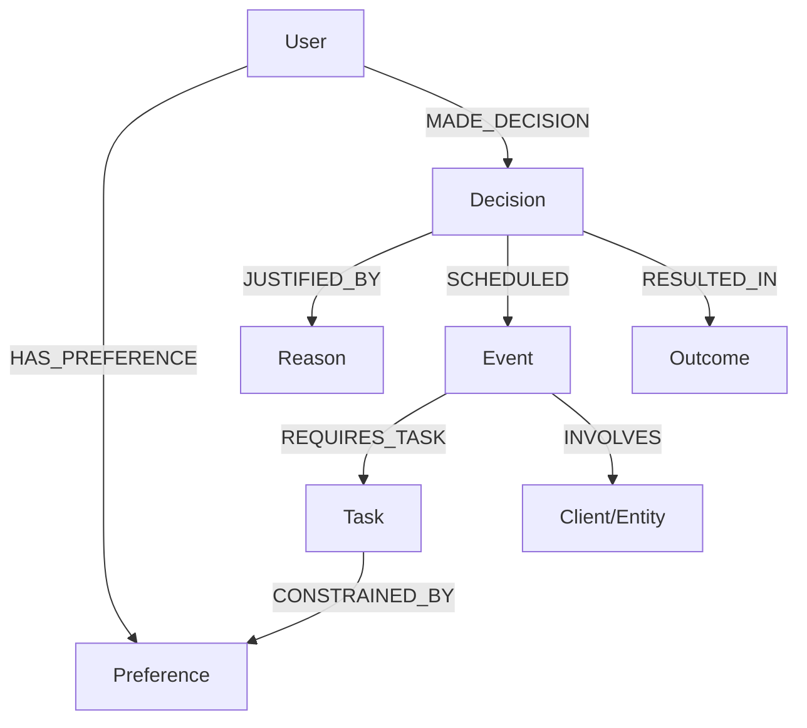
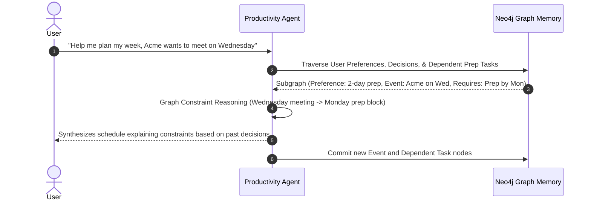

# Deep Architectural & Strategic Analysis: Neo4j Agent Memory Build Sprint

---

## Executive Summary & Official Constraints Alignment

- **Build Time Window:** ~2 hours (strictly prioritizing depth of one working journey over feature breadth).
- **Core Scoring Engine (50% of Total Score):**
  - **Meaningful Use of Neo4j & Graph Thinking:** 25%
  - **Agent Memory & Contextual Retrieval:** 25%
- **Mandatory Demonstration Requirement:** A visible, step-by-step lifecycle:
  $$\text{Teach / Interact} \longrightarrow \text{Graph Memory Commit} \longrightarrow \text{New Contextual Prompt} \longrightarrow \text{Graph Traversal Retrieval} \longrightarrow \text{Demonstrable Response Superiority}$$
- **Anti-Patterns to Avoid:** Flat key-value storage in Neo4j, treating Neo4j merely as a chat-log dump, hallucinated context windows, and over-engineered microservices.

---

# SECTION 1: Deep Analysis of Problem Statement 1
## Context-Aware Customer Support Agent

---

### 1. Problem Understanding
* **Exact Problem:** Support agents (human or AI) suffer from *interaction amnesia*. When a customer returns regarding a persistent or recurring issue, they are forced to repeat account details, previous troubleshooting steps, and product history. Standard chatbots treat each session as a clean slate or rely on flat message buffers that quickly overflow token limits and lack relational awareness.
* **Target Users:** Frustrated end customers who have multi-turn or multi-day support journeys; Tier-1/2 customer support teams who need instant context without reading long unstructured chat logs.
* **Core Pain Points:** 
  1. Repetitive explanations ("I already told support this yesterday").
  2. Groundhog-day troubleshooting (suggesting solutions that already failed).
  3. Disconnect between customer identity, product entitlement, reported symptoms, and prior resolutions.
* **Explicit Requirements:** Persistent memory across sessions; contextual understanding of Customer $\rightarrow$ Product $\rightarrow$ Issue $\rightarrow$ Previous Interaction $\rightarrow$ Resolution/Status.
* **Implicit Requirements:** The agent must differentiate between a brand-new issue and an ongoing/unresolved issue; it must detect when a previously applied fix failed.
* **Success Demonstration:** Customer says simply *"It's still not working"*; the agent immediately knows *who* they are, *what* product they are talking about, *what* exact issue occurred last week, *what* fix was attempted, acknowledges the previous failure, and advances to the next escalation or troubleshooting tier.

---

### 2. Core User Journey
1. **Day 1 (Turn 1):** Customer Alice states: *"My access to the Graph Data Science course isn't working. I purchased it last week under alice@example.com, and every time I click launch, it gives Error 403."*
2. **Memory Formation:** The agent resolves Alice, links her to the GDS course product, identifies the symptom (`Error 403`), logs the initial troubleshooting advice (`Clear cookies & verify SSO`), and creates a support interaction node with status `PENDING_VERIFICATION`.
3. **Day 3 (Turn 2):** Alice returns in a new session: *"It's still not working."*
4. **Contextual Retrieval:** The agent traverses from `Customer(Alice)` across active/unresolved issues, identifies the pending ticket, sees that `Clear cookies` failed, and responds:
   > *"Welcome back Alice. I see you're still experiencing Error 403 on your Graph Data Science course access after trying the browser reset. Since that didn't resolve the permission error, I've escalated your account provisioning directly to the platform team."*

---

### 3. Agent Memory Opportunities
* **What MUST Become Memory:**
  - Customer identity & communication channel (`id`, `email`, `name`).
  - Entitlements & purchased products (`Product`, `Order`).
  - Core problem entities & error signatures (`Issue`, `errorCode`, `symptom`).
  - Prescribed resolutions and their outcomes (`Resolution`, `FAILED` / `RESOLVED`).
  - Temporal continuity (`Interaction` timestamps, sequence of turns).
* **What MUST NOT Become Memory:**
  - Pleasantries, conversational filler (*"Hi"*, *"Thanks"*, *"Hold on a second"*).
  - Raw unparsed message history that bloats context.
  - Ephemeral session tokens or transient network errors.
* **How Memory Evolves:** When a customer states a fix didn't work, the relationship between `(Ticket)-[:ATTEMPTED_RESOLUTION]->(Resolution)` is updated with `status: "FAILED"`, and an escalation path is created.

---

### 4. Proposed Memory Model (Cognitive Layers)
* **Episodic Memory (Interactions & Events):** Nodes representing specific support sessions, timestamps, transcripts, and customer sentiment transitions.
* **Semantic Memory (Entities & Knowledge):** Customers, Products, Known Issues, Documentation articles, and Standard Operating Procedures.
* **Procedural/Status Memory (States & Transitions):** The lifecycle of a ticket (`OPEN` $\rightarrow$ `IN_PROGRESS` $\rightarrow$ `FAILED_RETRY` $\rightarrow$ `ESCALATED`).

---

### 5. Proposed Neo4j Graph Model


#### Node Labels & Properties:
- `:Customer {id, name, email, tier}`
- `:Product {id, name, category, version}`
- `:SupportTicket {id, status, priority, createdAt, updatedAt}`
- `:Issue {id, type, errorCode, description}`
- `:Resolution {id, actionTaken, instructions, recommendedAt}`
- `:Interaction {id, timestamp, channel, userMessage, agentSummary}`

#### Relationship Types:
- `(:Customer)-[:OWNS_PRODUCT]->(:Product)`
- `(:Customer)-[:OPENED_TICKET]->(:SupportTicket)`
- `(:SupportTicket)-[:TARGETS_PRODUCT]->(:Product)`
- `(:SupportTicket)-[:EXHIBITS_ISSUE]->(:Issue)`
- `(:SupportTicket)-[:HAS_INTERACTION]->(:Interaction)`
- `(:SupportTicket)-[:ATTEMPTED_RESOLUTION]->(:Resolution)`
- `(:Resolution)-[:RESULTED_IN {status: 'FAILED'|'RESOLVED'}]->(:SupportTicket)`

#### Key Cypher Retrieval Pattern:
```cypher
// Retrieve active customer issue context upon vague follow-up ("it's still not working")
MATCH (c:Customer {email: $email})-[:OPENED_TICKET]->(t:SupportTicket {status: 'OPEN'})
MATCH (t)-[:TARGETS_PRODUCT]->(p:Product)
MATCH (t)-[:EXHIBITS_ISSUE]->(i:Issue)
OPTIONAL MATCH (t)-[att:ATTEMPTED_RESOLUTION]->(r:Resolution)
OPTIONAL MATCH (t)-[:HAS_INTERACTION]->(lastInt:Interaction)
RETURN c.name AS customer, p.name AS product, i.description AS issue, 
       i.errorCode AS errorCode, r.actionTaken AS lastAttemptedFix, 
       att.status AS fixStatus, lastInt.agentSummary AS lastSummary
ORDER BY lastInt.timestamp DESC LIMIT 1
```

#### Why a Graph is Essential (vs SQL/Vector):
1. **Multi-hop context:** Connecting Customer $\rightarrow$ Ticket $\rightarrow$ Product $\rightarrow$ Issue $\rightarrow$ Failed Resolutions in a relational database requires a 5-table JOIN with complex foreign key constraints. In Neo4j, it is a natural, high-speed pointer-hop traversal.
2. **Multi-entity ambiguity resolution:** When a user says *"it"*, the graph directly resolves whether "it" refers to Product A or Product B based on active `(:SupportTicket {status: 'OPEN'})` edges.
3. **Pattern discovery:** Across multiple customers, graphs reveal clustering: e.g., 20 customers with `(:Customer)-[:OPENED_TICKET]->(:SupportTicket)-[:EXHIBITS_ISSUE]->(:Issue {errorCode: '403'})` targeting the same Product version reveals a widespread outage.

---

### 6. Memory Creation Strategy
1. **Intent & Entity Extraction:** LLM extracts structured entities: `CustomerIdentifier`, `ProductName`, `ErrorCode`, `Symptom`, `ResolutionFeedback`.
2. **Graph Upsert (Cypher MERGE):**
   - MERGE `Customer` by email/ID.
   - MERGE `Product` by SKU/Name.
   - MATCH or CREATE active `SupportTicket`.
   - CREATE `Interaction` tied to the Ticket.
3. **State Mutation:** If the user indicates a previous solution did not work, update the relationship property `[ATTEMPTED_RESOLUTION].status = 'FAILED'`.

---

### 7. Memory Retrieval Strategy
* **Step 1 - Entity Anchor Identification:** Identify customer identity (e.g., from login or email in message).
* **Step 2 - Subgraph Traversal:** Query 1-to-2 hops from Customer to find unresolved `SupportTicket` nodes and their associated `Issue`, `Product`, and `Resolution` nodes.
* **Step 3 - Relevance Filtering:** If no open tickets exist, fall back to historical resolved tickets for recurrent pattern detection.
* **Handling Irrelevant Memory:** If the user brings up an entirely different product (e.g., "I want to buy course B"), the graph traversal branches along a new `[:OWNS_PRODUCT]` or creates a new `SupportTicket`, leaving the existing unresolved ticket untouched without context pollution.

---

### 8. Agent Workflow


---

### 9. Minimal Technical Architecture
* **Frontend:** Clean, responsive Chat UI with a side-by-side **Live Graph Inspector** (showing active nodes & traversal paths in real-time).
* **Backend:** Lightweight FastAPI / Python backend or Node.js.
* **Agent Engine:** LangChain / LlamaIndex or native OpenAI/Gemini client with structured tool calling.
* **Database:** Neo4j AuraDB instance (already active and connected).

---

### 10. Must-Have MVP Features
1. Multi-turn cross-session continuity (session 1 registers issue; session 2 resolves vague follow-up).
2. Live Neo4j storage of Customer, Product, Ticket, Issue, and Resolution nodes.
3. Automated graph traversal extracting prior attempted fixes.
4. Visual proof of memory (UI showing the exact Cypher query and extracted graph context alongside the answer).

---

### 11. Optional / Stretch Features
- Automatic escalation trigger when $\ge 2$ resolutions fail.
- Cross-customer issue correlation ("3 other users reported this same 403 error on GDS course today").
- Admin dashboard to inspect global ticket graph.

---

### 12. Technical Risks & Practical Mitigations
* **Risk 1:** LLM generates invalid Cypher during retrieval.
  - *Mitigation:* Do not use Text2Cypher on user input. Use **parameterized, pre-compiled Cypher query templates** invoked by the agent or backend based on intent.
* **Risk 2:** Customer identity is missing in anonymous sessions.
  - *Mitigation:* Hardcode or provide a simple persona switcher in the UI (e.g., "Logged in as: Alice (alice@example.com)").
* **Risk 3:** Graph updates lag during live demo.
  - *Mitigation:* Run synchronous Cypher transactions with explicit commit before generating the UI response.

---

### 13. Demo Flow (The 3-Minute Winning Sequence)
1. **Act 1: Teach (The Initial Incident):**
   - Alice logs in. Types: *"Hi, I bought the Graph Data Science course last week, but when I open Module 2 I get Error 403."*
   - Agent responds with Step 1 troubleshooting (*"Try clearing cookies and resetting SSO"*).
   - *Visual cue:* Show Neo4j Browser/Visualizer with newly spawned nodes `(Alice)-[:OPENED_TICKET]->(Ticket)-[:TARGETS_PRODUCT]->(GDS)`.
2. **Act 2: The Amnesia Contrast (Baseline Without Graph Memory):**
   - Show a standard vanilla chatbot given *"It's still not working."* 
   - Vanilla responds: *"I'm sorry to hear that. What is not working? Can you provide your order number or describe the issue?"* (Frustrating, amnesiac).
3. **Act 3: The Memory-Driven Triumph (With Neo4j Memory):**
   - Alice opens a fresh session in our agent. Types: *"It's still not working."*
   - Our agent retrieves the graph subgraph in 12ms.
   - Responds: *"Welcome back, Alice. I see that resetting your cookies didn't resolve the Error 403 permission bug on your Graph Data Science course. Since Tier 1 troubleshooting failed, I have flagged your account with our engineering team under Ticket #1042."*
   - *Visual cue:* Show the edge `[:ATTEMPTED_RESOLUTION]` update to `status: 'FAILED'` on the graph.

---

### 14. Evaluation Criteria Mapping (PS-1)
| Criterion | Weight | How PS-1 Maximizes the Score |
|---|---|---|
| **Neo4j & Graph Thinking** | **25%** | Models entities and relationships that naturally form a graph (Customer $\rightarrow$ Ticket $\rightarrow$ Product $\rightarrow$ Issue $\rightarrow$ Resolution). Solves the multi-hop traversal problem that relational DBs struggle with. |
| **Agent Memory & Contextual Retrieval** | **25%** | Demonstrates cross-session episodic and stateful memory. Changes behavior dynamically when a prior resolution fails. |
| **Problem-Solution Fit** | **20%** | Solves one of the most recognizable real-world problems: support desk amnesia and repetitive customer queries. |
| **Working Implementation** | **15%** | Low architectural complexity; predictable parameterized queries ensure 100% demo reliability without query failure. |
| **Demo & UX** | **10%** | Extremely punchy before/after contrast (Vanilla Bot vs. Memory Bot) with side-by-side graph visualization. |
| **Innovation / Creativity** | **5%** | Introduces "Resolution Failure Awareness" where the agent adapts its troubleshooting strategy based on historical memory. |

---

### 15. Likely Jury Questions & Defensible Answers
* **Jury Question:** *"Why not just store the conversation history in a Postgres database or vector database?"*
  - **Answer:** *"A vector DB performs fuzzy similarity matching on raw text, which often pulls irrelevant historical chatter and struggles with exact state tracking (e.g., whether a specific ticket is currently OPEN or RESOLVED). A relational database requires extensive JOINs across 5 tables to reconstruct the active state of a user's issues. Neo4j allows us to traverse the exact subgraph of open tickets and their specific causal entities in one sub-millisecond query, preserving the exact relational semantics of Customer $\rightarrow$ Issue $\rightarrow$ Resolution."*
* **Jury Question:** *"What happens if the customer has 10 past tickets?"*
  - **Answer:** *"The Cypher traversal explicitly filters by `status: 'OPEN'` and orders by `lastInteraction.timestamp DESC`, ensuring only the active contextual subgraph is injected into the LLM prompt, keeping token usage minimal and context 100% relevant."*

---
---

# SECTION 2: Deep Analysis of Problem Statement 2
## Personal Productivity & Decision Memory Agent

---

### 1. Problem Understanding
* **Exact Problem:** Knowledge workers and leaders make dozens of decisions, establish preferences, and take on commitments every day. Traditional productivity tools (calendars, to-do lists, notes) are disconnected silos. AI assistants have no memory of *why* decisions were made, what trade-offs were accepted, or what personal constraints govern the user's schedule.
* **Target Users:** Busy professionals, founders, developers, and students juggling conflicting commitments, deadlines, and decision rationales.
* **Core Pain Points:**
  1. AI schedulers propose plans that violate known personal working styles (e.g., scheduling a deep-work client deck preparation 2 hours before the meeting).
  2. Loss of decision rationale ("Why did I choose Tech Stack X or reschedule Meeting Y two months ago?").
  3. Disconnected task dependencies where rescheduling one event causes silent breakage of preparation commitments.
* **Explicit Requirements:** Retain user preferences, tasks, decisions, commitments, and previous outcomes; use accumulated context to provide personalized recommendations; assist in revisiting or making decisions.
* **Implicit Requirements:** Graph must model *causality* and *dependencies* (e.g., Task A requires Task B; Event E has constraint C).
* **Success Demonstration:** User tells agent preferences and a decision rationale on Monday. On Thursday, user asks: *"Help me plan my week"* or *"Why did I postpone the presentation?"*. The agent uses graph traversals across preferences, decisions, and constraints to synthesize a reasoned, personalized plan that respects all hidden rules.

---

### 2. Core User Journey
1. **Day 1 (Preference & Decision Setting):** 
   - User: *"I prefer morning meetings, and I always need at least two full days to prepare for high-stakes client reviews."*
   - User: *"I've decided to hold the Acme Corp proposal review on Thursday at 10 AM, so I need to block Tuesday for proposal preparation."*
2. **Memory Formation:** 
   - Graph stores: `Preference(MorningMeetings)`, `Preference(PreparationBuffer: 2 days)`, `Decision(ScheduleAcmeReview)`, `Task(PrepareProposal)`, linked via `[:REQUIRES_BUFFER]`, `[:CONSTRAINED_BY]`, and `[:JUSTIFIED_BY]`.
3. **Day 3 (Planning & Conflicting Request):**
   - User: *"Acme Corp wants to move our review up to Tuesday morning. Can you rearrange my week?"*
4. **Contextual Retrieval & Reasoning:**
   - Agent traverses the decision tree and constraints. 
   - It detects that moving the review to Tuesday violates the 2-day preparation buffer decision made on Day 1.
   - Responds:
     > *"If you move Acme Corp to Tuesday at 10 AM, you will violate your established requirement of a 2-day prep buffer (since you only have Monday). To accommodate this while keeping your preparation commitment, we would need to compress your prep block to Monday afternoon and reschedule your internal sync. Would you like me to adjust the plan with that trade-off?"*

---

### 3. Agent Memory Opportunities
* **What MUST Become Memory:**
  - Explicit constraints & working preferences (`WorkingHours`, `DeepWorkBuffer`).
  - Decisions and their causal justifications (`Decision` $\rightarrow$ `[:BECAUSE]` $\rightarrow$ `Reason`).
  - Commitments, external milestones, and task dependencies.
  - Outcomes of past decisions (e.g., *"Last time we rushed a deck in 1 day, the client noticed errors"*).
* **What MUST NOT Become Memory:**
  - Casual brainstorming that wasn't finalized into a decision.
  - Temporary minor logistical notes.
* **How Memory Evolves:** When a decision outcome is recorded (e.g., *"The proposal won the client"* or *"Preparation was too rushed"*), it links back to the original `Decision` node to inform future recommendations.

---

### 4. Proposed Memory Model (Cognitive Layers)
* **Episodic Memory:** Specific meetings attended, tasks completed, timeline logs.
* **Declarative/Semantic Memory:** Hard rules, working preferences, client relationships.
* **Causal/Reasoning Memory (The Graph Superpower):** The *why* graph:
  $$\text{Event} \xrightarrow{\text{REQUIRES}} \text{Task} \xrightarrow{\text{CONSTRAINED\_BY}} \text{Preference} \xrightarrow{\text{JUSTIFIED\_BY}} \text{Reason}$$

---

### 5. Proposed Neo4j Graph Model


#### Node Labels & Properties:
- `:User {id, name}`
- `:Preference {id, type: 'BUFFER'|'TIME_OF_DAY', value: '2 days'|'MORNING', strength: 'HARD'|'SOFT'}`
- `:Decision {id, statement, timestamp}`
- `:Reason {id, rationale, context}`
- `:Event {id, title, startTime, endTime, importance: 'HIGH'|'NORMAL'}`
- `:Task {id, title, durationHours, deadline}`
- `:Outcome {id, result: 'SUCCESS'|'FAILURE', notes, recordedAt}`

#### Relationship Types:
- `(:User)-[:HOLDS_PREFERENCE]->(:Preference)`
- `(:User)-[:COMMITTED_TO]->(:Event)`
- `(:User)-[:EXECUTED_DECISION]->(:Decision)`
- `(:Decision)-[:GROUNDED_IN]->(:Reason)`
- `(:Decision)-[:AFFECTS]->(:Event)`
- `(:Event)-[:DEPENDS_ON]->(:Task)`
- `(:Task)-[:GOVERNED_BY]->(:Preference)`
- `(:Decision)-[:PRODUCED_OUTCOME]->(:Outcome)`

#### Key Cypher Retrieval Pattern:
```cypher
// Retrieve reasoning path: "Why did I plan this task on Monday?"
MATCH (u:User {name: $userName})-[:COMMITTED_TO]->(e:Event {title: $eventTitle})
MATCH (e)-[:DEPENDS_ON]->(t:Task)
OPTIONAL MATCH (e)<-[:AFFECTS]-(d:Decision)-[:GROUNDED_IN]->(r:Reason)
OPTIONAL MATCH (t)-[:GOVERNED_BY]->(p:Preference)
RETURN e.title AS event, e.startTime AS eventTime, t.title AS prepTask, 
       d.statement AS decisionMade, r.rationale AS why, p.value AS constraintRule
```

#### Why a Graph is Essential:
1. **Constraint Propagation & Dependency Chains:** If Event $E_2$ depends on Task $T_1$, and $T_1$ is constrained by Preference $P_1$, moving $E_2$ requires evaluating a directional dependency graph. Relational tables cannot perform recursive or multi-degree dependency walks without recursive CTEs that are notoriously brittle.
2. **Explaining "Why":** A vector search can find notes mentioning "presentation", but it cannot trace the topological path: $\text{Event} \leftarrow \text{Decision} \rightarrow \text{Reason} \rightarrow \text{Preference}$.

---

### 6. Memory Creation Strategy
1. **Extraction Pipeline:** LLM classifies statements into:
   - `PREFERENCE_DECLARATION` (e.g., *"I need 2 days to prepare"*)
   - `DECISION_DECLARATION` (e.g., *"I will schedule X on day Y because Z"*)
   - `OUTCOME_LOG` (e.g., *"That presentation went great, having 2 days made all the difference"*)
2. **Graph Assembly:**
   - Create nodes with appropriate labels.
   - Establish causal edges: `(Decision)-[:GROUNDED_IN]->(Reason)`.
   - Link tasks to their parent events: `(Event)-[:DEPENDS_ON]->(Task)`.

---

### 7. Memory Retrieval Strategy
* **Step 1:** Parse the user query for intent (e.g., `PLAN_SCHEDULE`, `QUERY_DECISION_RATIONALE`, `RESOLVE_CONFLICT`).
* **Step 2:** Subgraph fetch around relevant events and preferences for the upcoming week.
* **Step 3:** Feed the extracted graph topology (nodes + relationships) as structured JSON or text triples directly into the reasoning prompt of the LLM.
* **Relevance Filtering:** Limit traversal depth to 2 hops from the requested event/date to eliminate distant historical memories.

---

### 8. Agent Workflow


---

### 9. Minimal Technical Architecture
* **Frontend:** Clean productivity dashboard featuring a calendar/agenda view and a **Decision & Preference Graph Explorer**.
* **Backend:** FastAPI (Python) or Express (Node.js).
* **Graph Engine:** Neo4j AuraDB with Cypher driver.
* **Agent Engine:** Direct LLM API (Gemini/OpenAI) using strict schema extraction.

---

### 10. Must-Have MVP Features
1. Capture of user preferences and decision justifications into Neo4j.
2. Planning capability that actively incorporates graph constraints (e.g., buffer rules, task dependencies).
3. "Why did I decide this?" query capability that traverses the causal graph path.
4. Visible graph inspection in the UI showing nodes and relationship linkages.

---

### 11. Optional / Stretch Features
- Proactive conflict detection (notifying the user when an incoming calendar invite violates a stored graph preference).
- Decision outcome feedback loop (updating preference confidence based on outcomes).

---

### 12. Technical Risks & Practical Mitigations
* **Risk 1:** Time/scheduling math is notoriously hard for LLMs.
  - *Mitigation:* Do not let the LLM do date arithmetic in free text. Model time as discrete slots or pass calculated date diffs directly in the Cypher query.
* **Risk 2:** Overly subjective preferences that are difficult to convert into graph nodes.
  - *Mitigation:* Constrain the prototype to 3 concrete preference types: `TimeOfDayPreference`, `PreparationBufferPreference`, and `MeetingDurationPreference`.

---

### 13. Demo Flow (The 3-Minute Winning Sequence)
1. **Act 1: Set Preferences & Log Decision (Teach):**
   - User tells the agent: *"I never take client meetings before 11 AM, and I always require a 2-day prep block for client pitches. I've decided to pitch Acme on Thursday."*
   - Show graph rendering the nodes: `Preference`, `Decision`, `Reason`.
2. **Act 2: The Amnesiac Baseline:**
   - Standard Google Calendar or vanilla ChatGPT is asked: *"Schedule a review with Acme on Tuesday at 9 AM."*
   - Vanilla Bot schedules it blindly—violating both the morning rule and the 2-day prep rule.
3. **Act 3: The Memory Agent (With Graph Traversal):**
   - Our agent is asked: *"Acme wants to reschedule to Tuesday at 9 AM. What should I do?"*
   - Agent traverses the graph, detects two constraint violations, and responds:
     > *"Warning: Moving Acme to Tuesday at 9 AM violates two of your established principles:*
     > *1. No meetings before 11 AM.*
     > *2. 2-day prep buffer (you would only have Monday).*
     > *Recommendation: Propose Wednesday at 11 AM instead to preserve your 2-day prep window."*
   - Graph UI highlights the violated relationship path in red.

---

### 14. Evaluation Criteria Mapping (PS-2)
| Criterion | Weight | How PS-2 Maximizes the Score |
|---|---|---|
| **Neo4j & Graph Thinking** | **25%** | Dependency and causal graphs ($\text{Decision} \rightarrow \text{Reason} \rightarrow \text{Constraint} \rightarrow \text{Event}$) are inherently non-relational and cannot be represented cleanly in flat tables. |
| **Agent Memory & Contextual Retrieval** | **25%** | Retains not just facts, but *behavioral rules and rationales*. Demonstrates memory-driven constraint satisfaction. |
| **Problem-Solution Fit** | **20%** | Solves personal productivity friction with high executive/professional appeal. |
| **Working Implementation** | **15%** | Highly demonstrable in simulated turns without needing complex third-party API integrations. |
| **Demo & UX** | **10%** | The "Constraint Violation" visual alert creates an immediate "Aha!" moment for judges. |
| **Innovation / Creativity** | **5%** | "Decision Memory & Why" reasoning is a novel application beyond typical RAG or note-taking bots. |

---

### 15. Likely Jury Questions & Defensible Answers
* **Jury Question:** *"Isn't this just a rule-based calendar system?"*
  - **Answer:** *"No. Traditional calendars only store static start and end times. They have zero concept of causal rationale—why an event was placed there, what preparation task it depends on, or what personal productivity trade-off was accepted. By storing decisions as graph nodes linked to reasons and preferences, our agent can explain past choices and dynamically negotiate trade-offs when circumstances change."*
* **Jury Question:** *"How does Neo4j help when scaling to hundreds of decisions?"*
  - **Answer:** *"In a flat database, checking if a new event violates any past decision or constraint requires full-table scanning or complex joins. In Neo4j, we simply traverse the local neighborhood of `(:User)-[:HOLDS_PREFERENCE]` and `(:Event)-[:DEPENDS_ON]` within 2 degrees, keeping query latency sub-5ms regardless of how large the total graph grows."*

---
---

# SECTION 3: Head-to-Head Comparative Assessment & Strategic Recommendation

| Evaluation Dimension | Problem Statement 1: Context-Aware Customer Support | Problem Statement 2: Personal Productivity & Decision Memory | Strategic Winner |
|---|---|---|:---:|
| **Neo4j Graph Fit (25 pts)** | Very strong: Natural entity graph (Customer $\rightarrow$ Ticket $\rightarrow$ Product $\rightarrow$ Issue $\rightarrow$ Resolution). | Exceptional: Causal & dependency graph ($\text{Decision} \rightarrow \text{Reason} \rightarrow \text{Constraint} \rightarrow \text{Task}$). | **Tie** |
| **Agent Memory Fit (25 pts)** | Exceptional: Instant, unmistakable contrast between amnesic support vs. contextual memory ("It's still not working"). | Strong: High cognitive value, but requires more nuance to explain during a quick pitch. | **PS-1** |
| **2-Hour Hackathon Feasibility** | **Extremely High:** Straightforward entity schema, deterministic state updates, minimal edge cases. | **Moderate:** Date/time parsing, schedule math, and constraint conflict resolution can consume precious debugging time. | **PS-1** |
| **Demo Punchiness (10 pts)** | **Immediate "Aha!" Moment:** Anyone who has dealt with bad customer support immediately relates to the pain. | High intellectual appeal, but slightly slower to absorb in a 3-minute pitch. | **PS-1** |
| **Risk of Demo Failure** | **Very Low:** Parameterized Cypher queries for customer ticket lookup are 100% deterministic. | **Moderate:** If the LLM makes an arithmetic error with days of the week, the demo can look glitchy. | **PS-1** |

---

## Strategic Recommendation

Both Problem Statements are excellent and score exceptionally high on the 50% technical core (Graph Thinking + Agent Memory).

However, for a **~2-hour Mini-Hack Build Sprint**:

> **Problem Statement 1 (Context-Aware Customer Support Agent)** is the **superior strategic choice**:
> 1. **Immediate Universal Empathy:** Every judge and attendee has experienced the frustration of an AI bot asking: *"Can you tell me what course or product you're calling about?"* for the fourth time.
> 2. **Unbeatable Demo Simplicity:** Typing *"It's still not working"* and watching the agent instantly surface the exact product, error code, and failed resolution from Neo4j is a dramatic, unmistakable demonstration of Agent Memory.
> 3. **Rock-Solid Execution within 2 Hours:** The data model is clean, deterministic, and leaves zero room for LLM date-math hallucinations.
