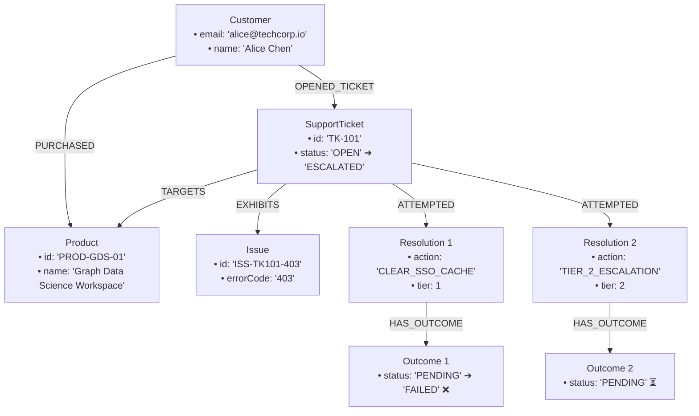

# NexusGraph Support — Implementation Walkthrough
### Neo4j × hackFront India Agent Memory Build Sprint Pune (PS-1)

---

## 🏆 Project Overview
**NexusGraph Support** is a context-aware customer support AI agent powered by **Neo4j Persistent Agent Memory**. It eliminates repetitive customer troubleshooting by decoupling conversational memory from ephemeral chat transcripts into a stateful, directional knowledge and episodic graph.

### The Problem It Solves
When a customer returns to support and says:
> *"It's still not working."*

Standard chatbots suffer from interaction amnesia, forcing customers to repeat their product name, account email, and symptoms, often proposing solutions that already failed. 

**NexusGraph Support** queries the active customer subgraph in Neo4j, detects the exact product (*Graph Data Science Workspace*), diagnoses the error (*403 Forbidden*), identifies the previously attempted troubleshooting step (*Clear SSO Cache*), marks that previous resolution as **FAILED**, and escalates the ticket to **Tier-2**—all without asking the user to repeat a single detail.

---

## 🛠️ System Architecture

```text
┌────────────────────────────────────────────────────────┐
│               REACT 18 + VITE FRONTEND                 │
│  • Split-Pane Chat Interface                           │
│  • 1-Click Scripted Demo Rehearsal Controls            │
│  • Live Interactive SVG Graph Inspector                │
│  • Real-Time Memory Status Badges                      │
│  • Optional Amnesiac Baseline Comparison Card          │
└───────────────────────────┬────────────────────────────┘
                            │ HTTP / REST (/api/chat, /api/graph)
┌───────────────────────────▼────────────────────────────┐
│                FASTAPI BACKEND ENGINE                  │
│  • Pydantic v2 Schema Validation                       │
│  • Heuristic & Intent-First Extraction Engine          │
│  • Deterministic State Machine Controller              │
│  • Zero Free-form Cypher / 100% Parameterized Library  │
└───────────────────────────┬────────────────────────────┘
                            │ Binary Bolt Protocol (neo4j+s://)
┌───────────────────────────▼────────────────────────────┐
│             NEO4J AURADB CLOUD INSTANCE                │
│  • Persistent Knowledge & Episodic Graph Memory        │
│  • Subgraph Traversal & Index-Free Adjacency           │
│  • Atomic Resolution-Outcome State Mutation            │
└────────────────────────────────────────────────────────┘
```

---

## 📊 Live Neo4j Graph Model



---

## 🧪 Verification & Test Results

The entire lifecycle was validated end-to-end across multiple automated test runs:

```text
=== 1. RESET DEMO ===
Reset: RESET_COMPLETE

=== 2. SEED DEMO ===
Seed: SEEDED {'customer': 'Alice Chen', 'product': 'Graph Data Science Workspace'}

=== 3. VERIFY INITIAL GRAPH ===
Initial Graph: 2 nodes, 1 edges (Customer -> Product)

=== 4. SESSION 1 CHAT (Report Error 403) ===
Session 1 Status: OPEN | Action: TICKET_CREATED_TIER_1_PRESCRIBED
Session 1 Reply: Hello Alice Chen. I have logged Ticket #TK-101 regarding Error 403 on your Graph Data Science Workspace. As a Tier-1 troubleshooting step, please clear browser session cache and re-authenticate via sso. Let me know if the issue persists.

=== 5. SESSION 2 CHAT ("It's still not working.") ===
Session 2 Status: ESCALATED | Action: RESOLUTION_FAILED_TICKET_ESCALATED
Session 2 Reply: Welcome back Alice Chen. I see that CLEAR_SSO_CACHE did not resolve Error 403 on your Graph Data Science Workspace. Since Tier-1 troubleshooting failed, I have escalated Ticket #TK-101 in the support workflow for Tier-2 review.

=== 6. VERIFY UPDATED GRAPH IN NEO4J ===
Updated Graph: 8 nodes, 8 edges
  • Customer: {'name': 'Alice Chen', 'email': 'alice@techcorp.io'}
  • Product: {'name': 'Graph Data Science Workspace', 'category': 'Cloud Graph Compute'}
  • SupportTicket: {'status': 'ESCALATED', 'priority': 'HIGH', 'id': 'TK-101'}
  • Issue: {'errorCode': '403', 'description': 'Workspace launch failure with permission denied'}
  • Resolution: {'actionName': 'CLEAR_SSO_CACHE', 'tier': 1}
  • Outcome: {'status': 'FAILED', 'feedback': "It's still not working."}
  • Resolution: {'actionName': 'TIER_2_ESCALATION', 'tier': 2}
  • Outcome: {'status': 'PENDING', 'feedback': 'Ticket queued for Tier-2 engineering review'}
```

---

## 🎬 How to Run & Pitch the Demo

### Live Services
* **Backend:** Running live on `http://localhost:8001` (Docs at `http://localhost:8001/docs`)
* **Frontend:** Running live on `http://localhost:5173`

### 3-Minute Presentation Script:
1. Open `http://localhost:5173`.
2. Click **[1. Seed Customer]**: Alice Chen and her purchased GDS Workspace appear in the Graph Inspector.
3. Click **[2. Send Session 1 Issue]**:
   - Alice reports: *"Hi, my Graph Data Science workspace is failing with Error 403 on launch."*
   - Watch the agent create Ticket `#TK-101 (OPEN)` and prescribe clearing SSO cache.
   - Point to the live Graph Inspector showing the newly spawned nodes and the `PENDING` outcome.
4. Click **[3. Simulate Break]**:
   - Chat history completely empties.
   - Tell the judges: *"We have completely wiped the browser's conversation state. A standard chatbot would now have zero memory."*
5. Click **[4. Send "It's still not working"]**:
   - The user sends a 4-word follow-up.
   - Point out how the agent immediately remembers Alice, the GDS Workspace, and Error 403.
   - Show how the graph mutated: Outcome 1 turned **FAILED ❌**, Ticket turned **ESCALATED ⚡**, and a Tier-2 resolution node appeared.
   - Optional: Toggle **"Show Amnesiac Baseline"** in the header to show how an ordinary bot asks repetitive questions.
6. Click **[5. Reset Demo]**: Resets the canvas for another pitch round.
